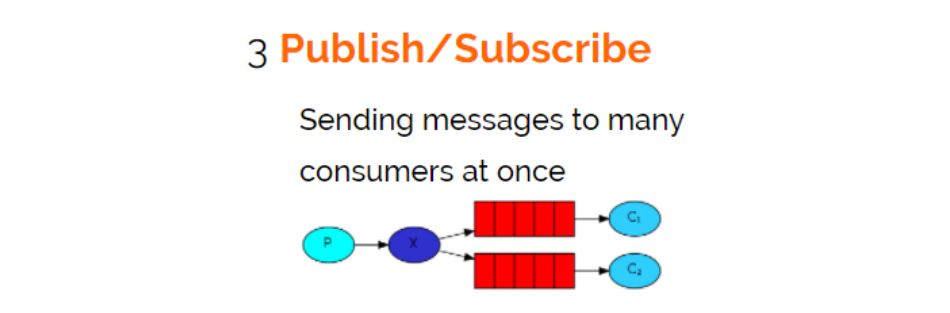

Publish/subscribe  
 
发布订阅模式： 
1、每个消费者监听自己的队列。 
2、生产者将消息发给broker，由交换机将消息转发到绑定此交换机的每个队列，每个绑定交换机的队列都将接收到消息。 
 
案例： 
用户通知，当用户充值成功或转账完成系统通知用户，通知方式有短信、邮件多种方法。 
 
测试 
打开RabbitMQ的管理界面，观察交换机绑定情况。 
使用生产者发送若干条消息，每条消息都转发到各各队列，每消费者都接收到了消息。 
 
思考 
1、publish/subscribe与work queues有什么区别。 
区别： 
1）work queues不用定义交换机，而publish/subscribe需要定义交换机。 
2）publish/subscribe的生产方是面向交换机发送消息，work queues的生产方是面向队列发送消息(底层使用默认交换机)。 
3）publish/subscribe需要设置队列和交换机的绑定，work queues不需要设置，实质上work queues会将队列绑定到默认的交换机 。 
相同点： 
所以两者实现的发布/订阅的效果是一样的，多个消费端监听同一个队列不会重复消费消息。 
 
2、实质工作用什么 publish/subscribe还是work queues。 
建议使用 publish/subscribe，发布订阅模式比工作队列模式更强大，并且发布订阅模式可以指定自己专用的交换机。 

  
@author:hong-2000 
交换机给每个队列发送数量内容相同的消息